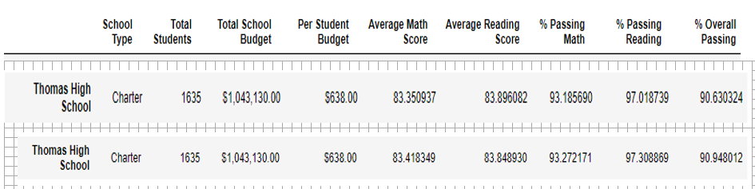
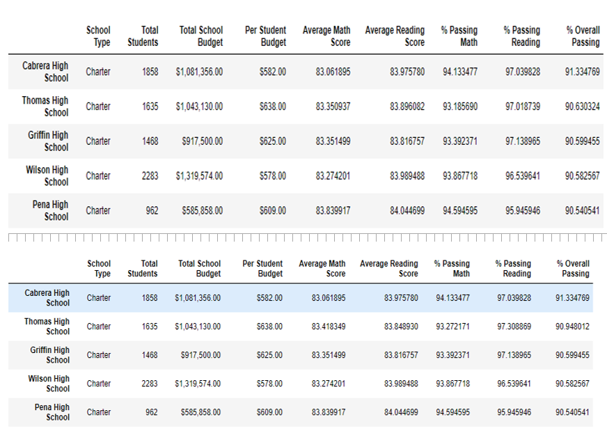
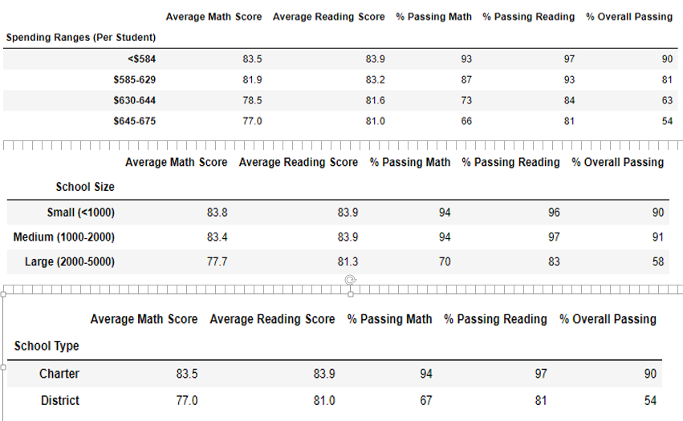

# School_District_Analysis

## Project Overview

The goal of this project is to revisit the district's analysis of test scores after removing the results for ninth graders at Thomas High School. The revisit is the result of suspicion of academic dishonesty. The report below describes how removing the scores for this group of students affected the district's overall performance. 

## Resources

* Data Sources: schools_complete.csv, students_complete.csv
* Software: Python 3.7.6; Jupyter Notebook 6.0.3

## Results 

Removing the reading and math test scores for ninth graders at Thomas High School resulted in the following conclusions. 

#### Note when appropriate the top portion of each of the images below reflects the results with ninth grade Thomas High School students removed.  

* District wide, the average math score drooped slightly while the average reading score remained the same. However, the percentage of students passing the math and reading tests dropped, suggesting Thomas High School students pass the tests at a higher rate than students at other high schools.

.

* At the school level, only results for Thomas High School changed. Specifically, the average math score dropped slightly, the average reading score increased slightly, and the percentage passing for each test - and overall - decreased slightly.    

.

* Prior to removing the results for its ninth graders, Thomas High School was among the highest performing schools in the district. After the removal, Thomas remained among the highest performing schools with the second highest overall passing rate.

.

* Finally, breaking down the district results to reflect different per-capita-spending, school size, and school type revealed very little change after the Thomas High School ninth graders were removed. To minimize potential confusion, below are the results only after the student removal. 

.

## Summary 

In sum, because of its relatively small size removing the questioned test results for ninth graders at Thomas High School had little effect on district-wide performance. Ninth grade math and reading scores across the district dropped by .2 percentage points or less. Thomas High School remained among the best performing schools, although that may come into question if the same anomalies are detected in the upper grade levels. Still, because the overall percentage passing dropped at Thomas High School once these students were removed, further scrutiny may be needed unless there is a defensible reason that ninth graders at that school would perform better then their upper class peers.    
