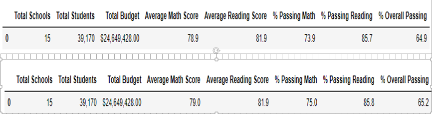

# School_District_Analysis

## Project Overview

The goal of this project is to revisit the district's analysis of test scores after removing the results for ninth graders at Thomas High School. The revisit is the result of suspicion of academic dishonesty. The report below describes how removing the scores for this group of students affected the district's overall performance. 

## Resources

* Data Sources: schools_complete.csv, students_complete.csv
* Software: Python 3.7.6; Jupyter Notebook 6.0.3

## Results 

Removing the reading and math test scores for ninth graders at Thomas High School resulted in the following conclusions. Note when appropriate the top portion of each of the images below reflects the results with ninth grade Thomas High School students removed.  

* District wide, the average math score drooped slightly while the average reading score remained the same. However, the percentage of students passing the math and reading tests dropped, suggesting Thomas High School students pass the tests at a higher rate than students at other high schools.

.
